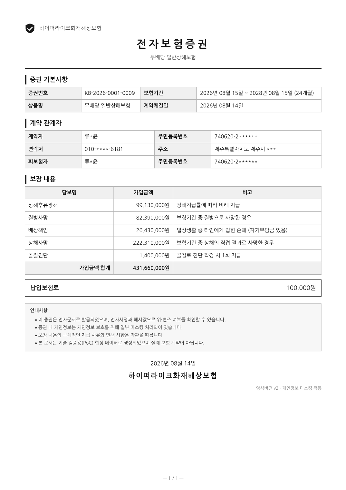

<div align="center">

# epolicy-issuer

**Electronic insurance policy issuance — a proof of concept in which the regulatory
requirements, not the libraries, decide the architecture.**

[](https://openjdk.org/)
[](https://spring.io/projects/spring-boot)
[](https://spring.io/projects/spring-batch)
[](https://pdfbox.apache.org/)
[](https://verapdf.org/)
[](https://www.etsi.org/)

**English** · [한국어](README.ko.md)

</div>

---

## Table of Contents

- [What this is](#what-this-is)
- [What it produces](#what-it-produces)
- [The pipeline](#the-pipeline)
- [Quick start](#quick-start)
- [What this PoC proves](#what-this-poc-proves)
- [The three decisions that shape everything](#the-three-decisions-that-shape-everything)
- [Project structure](#project-structure)
- [Tech stack](#tech-stack)
- [Out of scope](#out-of-scope)
- [Documentation](#documentation)

---

## What this is

Not a library benchmark. The point is to show **how regulatory requirements force the order
and the boundaries of a pipeline**.

Five requirements — long-term preservation (PDF/A), integrity proof (digital signature),
delivery evidence (issuance history), personal-data masking, and bulk issuance — each pin
down a part of the design that cannot be moved afterwards. That is what this repository
contains.

| Requirement | What it forces on the architecture |
|---|---|
| Long-term preservation | PDF/A compliance → fonts must be embedded, no external resources |
| Integrity proof | PAdES signature (+ TSA) → the file cannot be touched after signing |
| Delivery evidence | Issuance history + hashes → re-issuance needs an idempotency rule |
| Personal-data protection | Masking must happen **before** rendering, not in the template |
| Bulk issuance | Chunked batch + streaming → never hold a whole PDF on the heap |

## What it produces

<div align="center">
  
</div>

There is no front-end. The user-facing artifact **is** the PDF, so this is the closest thing to
a screen. What the image shows is the whole argument of the repository in one page:

- **The masking is in the data, not the styling.** `류*현`, `880324-1******`, `010-****-1694`,
  `대구광역시 동구 ***` — extract the text layer and that is exactly what comes out. Nothing is
  merely painted over.
- **Everything fits on one page, even at maximum coverage count.** Page count multiplies
  straight into render time and file size across 10,000 issuances.
- **The logo is vector, not raster.** An inline SVG drawn by Batik into PDF path operators —
  under 1KB, and it stays sharp at any zoom. Raster would be resolution-bound, which is the
  wrong trade for a document meant to outlive its viewer.
- **No external resources.** Fonts are embedded as subsets, the layout is pure CSS, scripts and
  external SVG references are blocked — all of it forced by PDF/A-1b.

The data is synthetic. To regenerate the image, issue a document and render page 1 with PDFBox's
`PDFRenderer` at 130 DPI.

## The pipeline

```
Load contract
      ↓
 [1] Apply masking        ← domain level; finished before rendering
      ↓
 [2] Bind template        Thymeleaf → HTML
      ↓
 [3] Render PDF           openhtmltopdf
      ↓
 [4] Convert to PDF/A-1b  PDFBox + ICC + XMP        ← must precede signing
      ↓
 [5] Compute contentHash  SHA-256                   ← the idempotency key
      ↓
 [6] PAdES signature      BouncyCastle (+ TSA)
      ↓
 [7] Store + record issuance history
```

Three of these steps cannot be reordered. The reasons are in
[docs/DESIGN.md §3](docs/DESIGN.md).

## Quick start

```bash
./gradlew test      # full verification, including veraPDF PDF/A checks — no network needed
./gradlew bootRun   # starts on H2 in-memory at http://localhost:8080
```

```bash
# seed 100 synthetic contracts → issue them in a batch → verify one
curl -XPOST 'localhost:8080/api/admin/seed?count=100'
curl -XPOST 'localhost:8080/api/admin/batch/run'
curl 'localhost:8080/api/verification/policies/KB-2026-0001-0000' | jq

# issue a single policy and download the document
curl -XPOST 'localhost:8080/api/policies/KB-2026-0001-0000/issue' | jq
curl -o policy.pdf 'localhost:8080/api/policies/KB-2026-0001-0000/document'
```

Running against PostgreSQL:

```bash
docker compose up -d
./gradlew bootRun --args='--spring.profiles.active=postgres'
```

Measuring:

```bash
./gradlew bootJar
java -Xmx512m -jar build/libs/epolicy-issuer-0.1.0-SNAPSHOT.jar \
  --spring.profiles.active=benchmark --count=10000 \
  --spring.main.web-application-type=none
```

It prints a Markdown table you can paste straight into
[docs/BENCHMARK.md](docs/BENCHMARK.md).

## What this PoC proves

| Success criterion | How it is checked | Result |
|---|---|---|
| 10,000 documents issued within a 512MB heap | `benchmark` profile with `-Xmx512m` | [BENCHMARK.md](docs/BENCHMARK.md) |
| Output passes PDF/A-1b validation | `PolicyIssuancePipelineTest.isPdfA1bCompliant` (veraPDF) | pass |
| Signature verifies, **and fails on a 1-byte change** | `DocumentIntegrityTest` | pass |
| Re-issuing the same contract yields the same contentHash | `IssuanceIdempotencyTest` | pass |
| No raw personal data in the PDF text layer | `PolicyIssuancePipelineTest.doesNotLeakPersonalDataIntoTextLayer` | pass |

veraPDF runs as a **library** (`org.verapdf:validation-model`) inside JUnit rather than as a
CLI. Nothing to install, and PDF/A compliance becomes a regression test instead of something
a human remembers to run. The same trick is used for timestamping: an
[in-process RFC 3161 TSA](src/test/java/com/hyunolike/epolicy/support/EmbeddedTsaServer.java)
exercises the PAdES-B-T path without any network.

## The three decisions that shape everything

**Masking lives in the domain, not the template.** Passing a raw resident registration number
to the template and hiding it with CSS leaves the original in the PDF text layer — extract the
text and it is right there. No visual review will ever catch that. So the render layer receives
`PolicyView`, whose every field is a `MaskedValue`, and `MaskedValue` rejects anything that
still *looks* unmasked. There is no code path from the template to the original.

**PDF/A conversion precedes signing.** Signing freezes the bytes; adding metadata afterwards
breaks the signature. This ordering is physical, not stylistic.

**Template versions are frozen, not edited.** Adding the logo meant creating
`templates/policy/v2/` rather than touching `v1`. Editing `v1` would have changed the
`contentHash` of every policy already issued under it — re-issuance must render with the form
that was in force at the time. A test pins this: after `v2` exists, re-issuing with `v1` still
produces byte-identical output.

**There are two hashes, deliberately.** `contentHash` (pre-signature) answers "is this the same
document?" and `fileHash` (post-signature) answers "has the stored file been touched?". A
signature embeds a timestamp, so identical content produces different files every time — judge
idempotency by `fileHash` and every re-issuance looks like a new document forever.

Making `contentHash` usable required the render to be deterministic: document dates come from
the contract date rather than the wall clock, the PDF `/ID` is derived from the policy number,
and the date locale is pinned. [docs/DESIGN.md](docs/DESIGN.md) has the full reasoning,
including what changed during implementation and why.

## Project structure

`application` defines the ports, `infrastructure` supplies the adapters — hexagonal-lite.

```
src/main/java/com/hyunolike/epolicy/
├─ domain/
│  ├─ contract/     Contract, Party, RegisteredNo, Money, Coverage
│  ├─ masking/      MaskingPolicy, MaskedValue          ← masking is domain logic
│  └─ document/     PolicyView, PolicyDocument, ContentHash, PdfArtifact
├─ application/
│  ├─ port/in/      IssuePolicyUseCase, VerifyDocumentUseCase
│  ├─ port/out/     TemplateRenderPort, PdfRenderPort, PdfArchivePort,
│  │                DocumentSignPort, TimestampPort, DocumentStoragePort,
│  │                IssuanceHistoryPort, ContractLoadPort, PdfArtifactFactory
│  └─ service/      PolicyIssuanceService, DocumentVerificationService
├─ infrastructure/
│  ├─ render/       ThymeleafTemplateAdapter, OpenHtmlPdfAdapter
│  ├─ pdfa/         PdfBoxArchiveAdapter
│  ├─ sign/         PadesSignAdapter, TsaClientAdapter, signature verification
│  ├─ storage/      LocalFsStorageAdapter
│  ├─ buffer/       InMemory / TempFile PdfArtifactFactory   ← the memory experiment
│  ├─ persistence/  JPA entities and adapters
│  └─ config/       port ↔ adapter wiring
├─ batch/           Spring Batch job, partitioner, skip listener
├─ api/             issuance / verification / admin controllers
└─ support/         synthetic data seeder, benchmark runner
```

The ports are fine-grained because comparing libraries is one of the goals. Swapping the
renderer for Playwright or PD4ML is a one-line change in `IssuanceConfiguration`; the pipeline
code does not move.

## Tech stack

| Area | Choice | Note |
|---|---|---|
| Runtime | Java 17 target, Spring Boot 3.3 | builds on JDK 17+ |
| Batch | Spring Batch 5 | chunked, optionally partitioned |
| Template | Thymeleaf | versioned directories (`templates/policy/v1/`, `v2/`) |
| PDF rendering | `io.github.openhtmltopdf` 1.1.85 | the PDFBox 3 fork, **not** the `danfickle` original |
| Inline SVG | `openhtmltopdf-svg-support` (Batik 1.17) | vector logo; transparency is forbidden by PDF/A-1 |
| PDF manipulation | Apache PDFBox 3.0.7 | PDF/A conversion, signing, verification |
| Signing | BouncyCastle 1.78.1 | PAdES-B-B / B-T |
| Timestamping | RFC 3161 (public TSA) | disabled by default |
| Database | H2 (local) / PostgreSQL (docker-compose) | |
| PDF/A validation | veraPDF 1.28.2 (library) | embedded in the test suite |

`openhtmltopdf` is **LGPL-2.1**. Linking it as a library is fine here, but your organisation's
distribution policy may still want a look. That is part of why `PdfRenderPort` leaves room for
a commercial comparison (PD4ML).

Fonts are Nanum Gothic (SIL Open Font License 1.1, see
`src/main/resources/fonts/OFL.txt`); the ICC profile is from Compact ICC Profiles (CC0).

## Out of scope

Decided against, not forgotten. Listed so the two are distinguishable.

- **Authentication / authorisation** — the issuance API is wide open. Knowing a policy number
  is enough to download someone else's document
- **Real accredited certificates** — a self-signed test certificate is generated at runtime, and
  the trust chain is not validated
- **Full policy terms** — a one-page summary only
- **Mobile signing UI** — server-side signing only
- **Encryption at rest for resident registration numbers** — acceptable only because the data is
  synthetic; mandatory for real data
- **Real personal data** — **never.** Only synthetic data is used, and the generated resident
  registration numbers carry a deliberately incorrect check digit, so they cannot collide with
  a real one

## Documentation

The design documents are written in Korean, since that is where the regulatory reasoning is
most precise. The tables and diagrams read across languages.

- [docs/DESIGN.md](docs/DESIGN.md) — design decisions with their reasoning, and what changed
  during implementation
- [docs/COMPLIANCE.md](docs/COMPLIANCE.md) — requirement ↔ implementation ↔ verification matrix,
  plus the gaps left open on purpose
- [docs/BENCHMARK.md](docs/BENCHMARK.md) — measurement results
